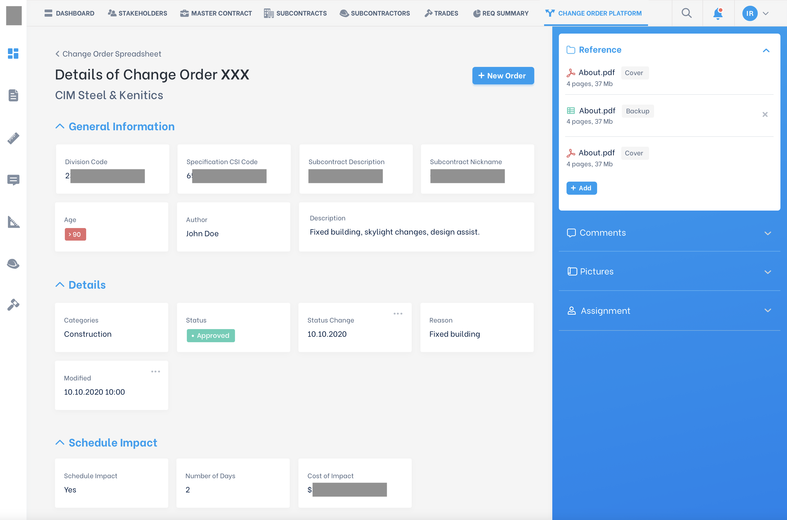
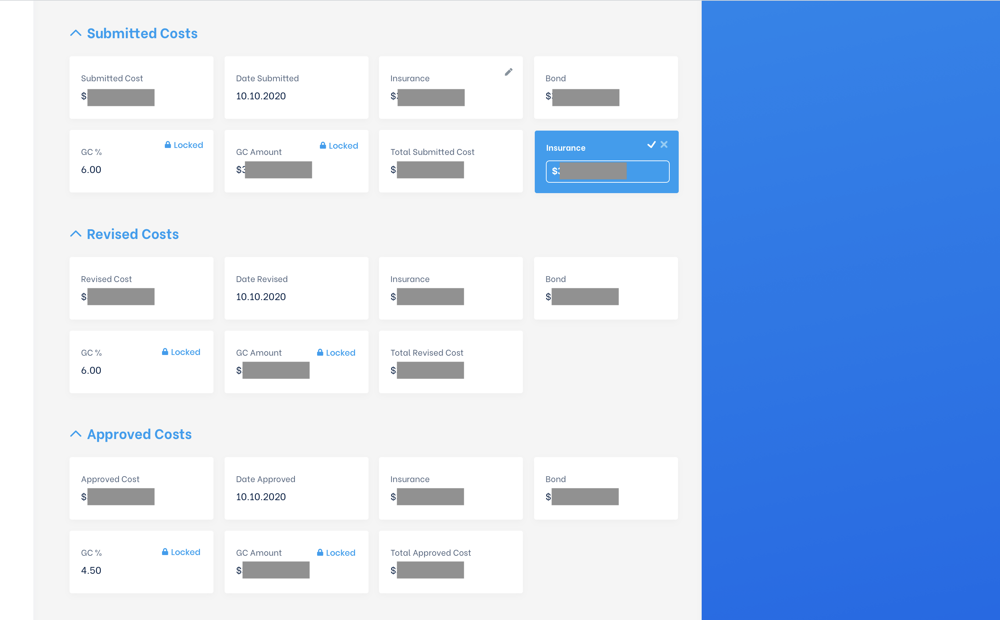

# Front End Interview. Technical Task

## About

On the screenshots below you can find a typical Show page for the entity. Here is a Change Order. The details are presented in formatted fields in cards. The layout is responsive, while the cards have limited responsiveness (fixed height and semi-fixed widths). Clicking on the data in some of the cards enables inline editing with auto formatting and error checking. In some cases through dropdowns and/or autocomplete.

On the right sidebar you can see widgets - reusable services for different tasks - files, photos, comments and others. They are not done through iframes, rather being a part of the project's codebase.

## Screenshots

## Task

Replicate the show page. You do NOT need to have:

- hosting or server to deploy the app
- left sidebar
- top headbar
- editing functionality for ALL the fields
- functionality for ALL the buttons
- functionality of right sidebar
- full styling of right sidebar (while the resemblance should be matching)

You DO need to have the following:

- Editing functionality should be provided for at least 3 fields:
  - Number of days
  - Cost of impact
  - Submitted cost
- Clicking on the pen icon in the card's corner should enable editing mode for some cards.
- Clicking on the check icon stores the changes; cross - ignores.
- All data should be kept in Redux store.
- The data should be send to API (no need to have the functionality, just structure for the requests);
- The data should be fetched from the API and stored in Redux store (no need to have the functionality, just structure for the requests);
- The widgets on the right sidebar (white dialogues) should be foldable (no animation is required)
- Previous/Next buttons at the bottom should be floating
- Foldable sections with cards on the page (no animation is required)
- Page should be responsive (desktop, not for mobile).
- Would be nice to have comments on the complicated functions, if any.
- README with instruction to run, if different from standard.

## Stack

Use:

- React (CRA)
- Redux
- TypeScript
- CSS/SCSS

Don't use:

- Any UI frameworks
